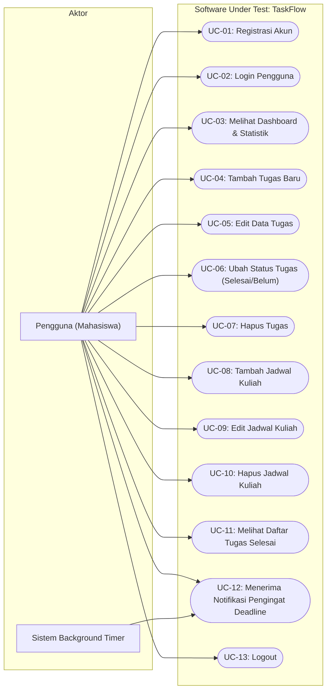

# DOKUMEN SPESIFIKASI KEBUTUHAN PERANGKAT LUNAK (SOFTWARE REQUIREMENT SPECIFICATION)
## SOFTWARE UNDER TEST (SUT) - MATA KULIAH PENJAMINAN KUALITAS PERANGKAT LUNAK (PKPL)

---

### IDENTITAS PENGUMPULAN TUGAS
* **Mata Kuliah:** Penjaminan Kualitas Perangkat Lunak (PKPL)
* **Topik Tugas:** Pengumpulan Dokumen Requirement Software Under Test (SUT)
* **Nama Mahasiswa:** Fajri Ahmad Siregar
* **NIM:** 202010370311465
* **Program Studi:** Teknik Informatika
* **Fakultas / Universitas:** Fakultas Teknik, Universitas Muhammadiyah Malang
* **Nama Perangkat Lunak (SUT):** **TaskFlow** *(Mobile Task & Academic Schedule Management App)*
* **Tautan Desain UI (Figma):** [Figma UI TaskFlow](https://www.figma.com/make/QYTXHB3ZRi2pehAXT4YHP2/Mobile-Task-Manager-UI?t=mX7CbZVrhToP8y9H-1)
* **Teknologi Implementasi:** Flutter SDK (Dart), GetX Architecture & Material Design 3

---

## 1. PENDAHULUAN DAN LINGKUP SOFTWARE UNDER TEST (SUT)

### 1.1 Deskripsi Umum SUT
**TaskFlow** adalah perangkat lunak manajemen aktivitas akademik mahasiswa yang dibangun menggunakan framework **Flutter (Dart)**. Aplikasi ini dirancang untuk mengatasi permasalahan mahasiswa dalam mengorganisasi tugas kuliah, memantau tenggat waktu (deadline), dan mencatat jadwal perkuliahan mingguan. 

Sebagai *Software Under Test* (SUT) pada mata kuliah Penjaminan Kualitas Perangkat Lunak (PKPL), sistem ini memiliki logika bisnis fungsional yang padat, mencakup validasi input, kalkulasi statistik penyelesaian tugas secara reaktif, filter pengelompokan jadwal berdasarkan hari, serta mekanisme otomatisasi evaluasi tenggat waktu (*reminder & overdue engine*) yang sangat relevan untuk diuji menggunakan berbagai teknik pengujian (Black-Box Testing, Equivalence Partitioning, Boundary Value Analysis, hingga State Transition Testing).

### 1.2 Batasan Pengujian (Scope of Testing)
* **Dalam Lingkup (In-Scope):**
  1. Modul Autentikasi Pengguna (Pendaftaran/Registrasi akun dan Login).
  2. Modul Manajemen Tugas (Create, Read, Update, Delete, Toggle Complete, Kategori, dan Deadline).
  3. Modul Dashboard & Statistik Progres (Kalkulasi realtime status Total, Done, dan Pending).
  4. Modul Manajemen Jadwal Kuliah (CRUD Jadwal, pengelompokan 7 hari Senin–Minggu, dan rentang jam kuliah).
  5. Modul Halaman Tugas Selesai (*Completed Tasks View*).
  6. Modul Pengingat Otomatis (*Notification & Reminder Engine* dengan deteksi toleransi waktu < 1 jam dan status kedaluwarsa/overdue).
* **Di Luar Lingkup (Out-of-Scope):**
  1. Integrasi payment gateway dan cloud synchronization database multi-user pihak ketiga (pada versi rilis saat ini data dikelola pada state arsitektur aplikasi/in-memory).

---

## 2. SPESIFIKASI KEBUTUHAN: USE CASE MODEL & DESKRIPSI LENGKAP

### 2.1 Use Case Diagram (UML)

---

### 2.2 Use Case Descriptions (Spesifikasi Naratif Use Case)

#### UC-01: Registrasi Akun
* **Aktor:** Pengguna (Mahasiswa)
* **Deskripsi:** Pengguna mendaftarkan akun baru ke dalam sistem TaskFlow.
* **Prakondisi:** Pengguna berada pada halaman Login dan memilih menu daftar akun.
* **Paskakondisi:** Akun terdaftar dan sistem mengarahkan kembali pengguna ke halaman Login.
* **Alur Utama (Normal Flow):**
  1. Pengguna membuka halaman *Register*.
  2. Pengguna mengisi nama lengkap, alamat email, dan password.
  3. Pengguna menekan tombol "Daftar".
  4. Sistem memproses pendaftaran dan menampilkan pesan notifikasi bahwa akun berhasil dibuat.
  5. Sistem mengarahkan pengguna kembali ke halaman Login.
* **Alur Alternatif / Eksepsi (Exception Flow):**
  - **4a.** Jika kolom input nama, email, atau password kosong, sistem menolak pembuatan akun dan meminta pengguna melengkapi data.

---

#### UC-02: Login Pengguna
* **Aktor:** Pengguna (Mahasiswa)
* **Deskripsi:** Pengguna melakukan autentikasi untuk mengakses workspace TaskFlow.
* **Prakondisi:** Pengguna membuka aplikasi dan berada pada halaman Login.
* **Paskakondisi:** Pengguna berhasil terautentikasi dan diarahkan ke halaman Dashboard (Main Layout).
* **Alur Utama (Normal Flow):**
  1. Pengguna memasukkan alamat email dan password.
  2. Pengguna menekan tombol "Login".
  3. Sistem memverifikasi kredensial pengguna dan menampilkan animasi loading indikator.
  4. Sistem membuka antarmuka utama (*Main Dashboard Layout*).
* **Alur Alternatif / Eksepsi:**
  - **3a.** Jika format isian email/password tidak sesuai, sistem menampilkan indikasi validasi dan tidak melanjutkan proses navigasi.

---

#### UC-03: Melihat Dashboard & Statistik Progres
* **Aktor:** Pengguna (Mahasiswa)
* **Deskripsi:** Pengguna melihat ikhtisar akumulasi tugas (Total Tugas, Tugas Selesai, dan Tugas Tertunda) serta ringkasan daftar tugas.
* **Prakondisi:** Pengguna telah melakukan login.
* **Paskakondisi:** Tampilan metriks statistik terbarui secara reaktif sesuai kondisi data terkini.
* **Alur Utama (Normal Flow):**
  1. Pengguna memilih menu "Dashboard" pada sidebar navigasi.
  2. Sistem menghitung secara otomatis:
     - Jumlah seluruh tugas ($Total = Done + Pending$)
     - Jumlah tugas berstatus selesai ($Done$)
     - Jumlah tugas yang belum diselesaikan ($Pending$)
  3. Sistem menampilkan kartu ringkasan visual Total, Done, dan Pending.
  4. Sistem menampilkan daftar seluruh kartu tugas aktif di bawah kartu statistik.

---

#### UC-04: Tambah Tugas Baru
* **Aktor:** Pengguna (Mahasiswa)
* **Deskripsi:** Pengguna menambahkan item tugas baru lengkap dengan kategori dan tenggat waktu (deadline).
* **Prakondisi:** Pengguna berada di halaman Dashboard, Tasks, atau Completed.
* **Paskakondisi:** Tugas baru tersimpan dalam daftar dan statistik diperbarui.
* **Alur Utama (Normal Flow):**
  1. Pengguna menekan tombol Floating Action Button (+).
  2. Sistem menampilkan modal pop-up dialog "Tugas Baru".
  3. Pengguna memasukkan judul tugas pada input text.
  4. Pengguna memilih salah satu kategori (Umum, Kuliah, Kerja, Pribadi).
  5. Pengguna memilih tanggal dan jam tenggat waktu (*deadline picker*) (opsional).
  6. Pengguna menekan tombol "Tambah".
  7. Sistem memvalidasi judul tugas tidak kosong.
  8. Sistem menyimpan data tugas baru dan memperbarui tampilan daftar tugas.
* **Alur Alternatif / Eksepsi:**
  - **7a.** Jika input judul tugas hanya berisi spasi atau kosong, sistem membatalkan penambahan dan tidak menyimpan data.

---

#### UC-05: Edit Data Tugas
* **Aktor:** Pengguna (Mahasiswa)
* **Deskripsi:** Pengguna memperbarui rincian tugas yang sudah ada sebelumnya.
* **Prakondisi:** Terdapat minimal 1 data tugas pada daftar.
* **Paskakondisi:** Data tugas terbarui dengan nilai yang baru dimasukkan.
* **Alur Utama (Normal Flow):**
  1. Pengguna menekan ikon "Edit" pada kartu tugas yang diinginkan.
  2. Sistem membuka modal dialog "Edit Tugas" yang telah terisi data lama.
  3. Pengguna mengubah judul, mengubah kategori, atau memperbarui tanggal/jam deadline (atau menghapus deadline).
  4. Pengguna menekan tombol "Simpan".
  5. Sistem memperbarui data objek tugas dan merefleksikannya pada UI.
* **Alur Alternatif / Eksepsi:**
  - **4a.** Jika pengguna mengosongkan judul tugas, pembaruan diabaikan.
  - **4b.** Jika pengguna menekan "Batal", sistem menutup modal tanpa menyimpan perubahan.

---

#### UC-06: Ubah Status Tugas (Tandai Selesai / Belum Selesai)
* **Aktor:** Pengguna (Mahasiswa)
* **Deskripsi:** Pengguna mengubah status ketercapaian tugas (dari belum selesai menjadi selesai, atau sebaliknya).
* **Prakondisi:** Tugas ditampilkan pada layar (Dashboard / Tasks / Completed).
* **Paskakondisi:** Atribut `done` tugas berbalik nilai (true <-> false), teks judul tercoret/normal, dan kartu statistik diperbarui.
* **Alur Utama (Normal Flow):**
  1. Pengguna menekan ikon status checklist pada kartu tugas.
  2. Sistem mengubah status tugas (`done = !done`).
  3. Sistem memindahkan representasi visual tugas: jika selesai, judul diberi efek *strikethrough* dan ikon centang hijau; jika dibatalkan, kembali normal.
  4. Sistem memperbarui penghitungan counter *Done* dan *Pending*.

---

#### UC-07: Hapus Tugas (dengan Konfirmasi)
* **Aktor:** Pengguna (Mahasiswa)
* **Deskripsi:** Pengguna menghapus item tugas yang tidak lagi dibutuhkan.
* **Prakondisi:** Terdapat item tugas pada daftar.
* **Paskakondisi:** Tugas dihapus secara permanen dari daftar tugas aktif dan statistik berkurang.
* **Alur Utama (Normal Flow):**
  1. Pengguna menekan ikon "Hapus" (tong sampah) pada kartu tugas.
  2. Sistem memunculkan dialog konfirmasi: *"Yakin akan menghapus [Nama Tugas]?"* dengan opsi "Batal" dan "Hapus".
  3. Pengguna menekan tombol "Hapus".
  4. Sistem menghapus data tugas dari memori dan menutup dialog.
  5. Tampilan daftar tugas dan jumlah total/done/pending diperbarui seketika.
* **Alur Alternatif:**
  - **3a.** Pengguna menekan tombol "Batal", sistem menutup dialog tanpa menghapus tugas.

---

#### UC-08: Tambah Jadwal Kuliah
* **Aktor:** Pengguna (Mahasiswa)
* **Deskripsi:** Pengguna membuat jadwal perkuliahan baru berdasarkan hari dan jam.
* **Prakondisi:** Pengguna membuka tab navigasi "Jadwal".
* **Paskakondisi:** Jadwal tersimpan dan muncul di bawah pengelompokan hari yang sesuai.
* **Alur Utama (Normal Flow):**
  1. Pengguna menekan tombol "Tambah Jadwal".
  2. Sistem menampilkan modal dialog "Tambah Jadwal".
  3. Pengguna menginput nama mata kuliah.
  4. Pengguna memilih hari perkuliahan (Senin, Selasa, Rabu, Kamis, Jumat, Sabtu, atau Minggu).
  5. Pengguna mengatur jam mulai kuliah menggunakan *TimePicker*.
  6. Pengguna mengatur jam selesai kuliah menggunakan *TimePicker*.
  7. Pengguna menekan tombol "Tambah".
  8. Sistem menyimpan data jadwal dan mengelompokkannya secara terurut pada hari yang dipilih.
* **Alur Alternatif:**
  - **7a.** Jika nama mata kuliah kosong, sistem menolak penyimpanan data.

---

#### UC-09: Edit Jadwal Kuliah
* **Aktor:** Pengguna (Mahasiswa)
* **Deskripsi:** Pengguna mengubah mata kuliah, hari, atau rentang jam perkuliahan yang telah dicatat.
* **Prakondisi:** Terdapat data jadwal kuliah yang ingin diubah.
* **Paskakondisi:** Perubahan jadwal tersimpan pada sistem.
* **Alur Utama (Normal Flow):**
  1. Pengguna menekan ikon "Edit" pada item jadwal kuliah.
  2. Sistem menampilkan modal dialog "Edit Jadwal" berisi data eksisting.
  3. Pengguna mengubah data yang diinginkan (nama matkul, hari, atau jam).
  4. Pengguna menekan tombol "Simpan".
  5. Sistem memperbarui jadwal pada list harian terkait.

---

#### UC-10: Hapus Jadwal Kuliah (dengan Konfirmasi)
* **Aktor:** Pengguna (Mahasiswa)
* **Deskripsi:** Pengguna menghapus jadwal perkuliahan tertentu.
* **Prakondisi:** Terdapat data jadwal pada daftar.
* **Paskakondisi:** Jadwal terhapus dari daftar hari terkait.
* **Alur Utama (Normal Flow):**
  1. Pengguna menekan ikon "Hapus" pada item jadwal kuliah.
  2. Sistem menampilkan dialog konfirmasi penghapusan jadwal.
  3. Pengguna menekan tombol "Hapus".
  4. Sistem menghapus data jadwal dan memperbarui tampilan.
* **Alur Alternatif:**
  - **3a.** Pengguna menekan "Batal", proses penghapusan dibatalkan.

---

#### UC-11: Melihat Daftar Tugas Selesai (Completed View)
* **Aktor:** Pengguna (Mahasiswa)
* **Deskripsi:** Pengguna melihat arsip tugas-tugas yang telah berhasil diselesaikan.
* **Prakondisi:** Pengguna memilih tab navigasi "Completed".
* **Paskakondisi:** Sistem hanya memfilter dan menampilkan tugas dengan status `done == true`.
* **Alur Utama (Normal Flow):**
  1. Pengguna mengklik tab "Completed".
  2. Sistem memfilter koleksi tugas yang atribut `done`-nya bernilai true.
  3. Sistem menampilkan jumlah tugas selesai serta daftar item tugas tersebut.
  4. Pengguna dapat melakukan toggle status kembali ke pending, mengedit, atau menghapusnya jika diinginkan.
* **Alur Alternatif:**
  - **2a.** Jika belum ada tugas yang selesai, sistem menampilkan pesan informatif: *"Belum ada tugas yang selesai. Tandai tugas di halaman Tasks sebagai selesai."*

---

#### UC-12: Deteksi & Notifikasi Pengingat Deadline Otomatis
* **Aktor:** Sistem Background Timer, Pengguna (Mahasiswa)
* **Deskripsi:** Sistem mengevaluasi secara otomatis setiap interval waktu tertentu terhadap deadline tugas dan menampilkan peringatan.
* **Prakondisi:** Pengguna memiliki tugas dengan tenggat waktu (deadline) yang belum diselesaikan (`done == false`).
* **Paskakondisi:** Badge notifikasi menampilkan jumlah tugas mendesak/terlambat, dan pengguna dapat membuka panel rincian pengingat.
* **Alur Utama (Normal Flow):**
  1. Timer sistem berjalan secara otomatis di latar belakang (setiap 30 detik).
  2. Sistem memfilter tugas:
     - Jika $WaktuSekarang > Deadline$, tugas ditandai **Overdue (Terlambat)** dengan label merah.
     - Jika $(Deadline - WaktuSekarang) \le 1\text{ Jam}$, tugas ditandai **Due Soon (Mendekati Deadline)** dengan label oranye.
  3. Sistem menampilkan angka counter peringatan berwarna merah pada ikon lonceng di AppBar.
  4. Pengguna menekan ikon lonceng notifikasi.
  5. Sistem menampilkan modal pop-up "Pengingat" berisi daftar tugas mendesak berurutan dari tenggat paling dekat, lengkap dengan estimasi selisih waktu (contoh: "Terlambat 15 menit" atau "45 menit lagi").

---

#### UC-13: Logout Pengguna
* **Aktor:** Pengguna (Mahasiswa)
* **Deskripsi:** Pengguna keluar dari sesi aplikasi.
* **Prakondisi:** Pengguna berada di dalam aplikasi (Main Layout).
* **Paskakondisi:** Sesi berakhir dan aplikasi kembali ke layar Login.
* **Alur Utama (Normal Flow):**
  1. Pengguna menekan menu "Logout" pada bagian bawah sidebar navigasi.
  2. Sistem menghapus riwayat navigasi dan mengarahkan kembali pengguna ke halaman Login.

---

## 3. SPESIFIKASI KEBUTUHAN: USER STORIES & ACCEPTANCE CRITERIA (SRS AGILITAS PKPL)

Format kebutuhan ini disiapkan secara khusus untuk memudahkan pembuatan **Test Scenarios** dan **Test Cases** (format BDD / Given-When-Then) dalam tahapan pengujian perangkat lunak PKPL.

| ID Story | User Story (As a... I want to... So that...) | Acceptance Criteria (Given - When - Then) |
|---|---|---|
| **US-01** | **Sebagai** mahasiswa, **saya ingin** mendaftar akun baru, **agar** saya memiliki akses personal ke TaskFlow. | **Scenario 1: Registrasi Berhasil** - *Given:* Pengguna berada di form register. - *When:* Pengguna memasukkan nama, email valid, password, lalu menekan "Daftar". - *Then:* Muncul notifikasi sukses dan layar berpindah ke Login. **Scenario 2: Validasi Field Kosong** - *Given:* Pengguna di form register. - *When:* Pengguna mengosongkan nama/email/password dan menekan "Daftar". - *Then:* Sistem menolak proses dan pengguna tetap di halaman register. |
| **US-02** | **Sebagai** mahasiswa, **saya ingin** login dengan email dan password, **agar** saya bisa membuka workspace tugas saya. | **Scenario 1: Login Berhasil** - *Given:* Pengguna berada di form login. - *When:* Pengguna mengisi email & password lalu klik "Login". - *Then:* Tampil loading indicator selama 1 detik dan diarahkan ke Dashboard. **Scenario 2: Tampilan Tersembunyi Password** - *Given:* Pengguna mengetik password. - *When:* Karakter diketikkan. - *Then:* Teks password disamarkan (*obscured*). |
| **US-03** | **Sebagai** mahasiswa, **saya ingin** melihat kartu statistik Total, Done, dan Pending di Dashboard, **agar** saya tahu progres tugas secara cepat. | **Scenario 1: Sinkronisasi Angka Statistik** - *Given:* Pengguna memiliki $N$ tugas ($X$ selesai, $Y$ belum). - *When:* Pengguna membuka halaman Dashboard. - *Then:* Kartu Total menampilkan $N$, Done menampilkan $X$, dan Pending menampilkan $Y$. |
| **US-04** | **Sebagai** mahasiswa, **saya ingin** menambahkan tugas baru dengan judul, kategori, dan deadline, **agar** pekerjaan saya tercatat rapi. | **Scenario 1: Tambah Tugas Valid** - *Given:* Dialog "Tugas Baru" terbuka. - *When:* Pengguna mengisi judul "Tugas PKPL", kategori "Kuliah", tanggal deadline esok hari, lalu klik "Tambah". - *Then:* Tugas tersimpan, muncul di list, dan counter Total bertambah 1. **Scenario 2: Boundary/Empty Input** - *Given:* Dialog tambah tugas terbuka. - *When:* Pengguna menekan tombol "Tambah" dengan judul kosong/spasi. - *Then:* Sistem tidak menambahkan data apapun ke daftar tugas. |
| **US-05** | **Sebagai** mahasiswa, **saya ingin** mengedit tugas yang sudah dibuat, **agar** saya bisa memperbarui judul, kategori, atau tanggal deadline. | **Scenario 1: Edit Berhasil** - *Given:* Tugas bernama "Desain UI" ada di list. - *When:* Pengguna mengedit judul menjadi "Desain UI Mobile Fix" dan klik "Simpan". - *Then:* Judul tugas pada kartu tugas langsung berubah menjadi teks baru. **Scenario 2: Hapus Deadline** - *Given:* Tugas memiliki deadline. - *When:* Pengguna menekan tombol "Hapus deadline" (ikon silang) lalu menyimpan. - *Then:* Tugas tersebut tidak lagi memiliki atribut deadline. |
| **US-06** | **Sebagai** mahasiswa, **saya ingin** menandai tugas sebagai selesai atau belum selesai, **agar** status pekerjaan saya selalu akurat. | **Scenario 1: Centang Tugas Menjadi Selesai** - *Given:* Tugas berstatus belum selesai (`done == false`). - *When:* Pengguna mengklik tombol checklist pada kartu tugas. - *Then:* Status tugas berubah menjadi selesai, judul tercoret (*strikethrough*), dan counter Done bertambah 1. **Scenario 2: Uncheck Tugas Selesai** - *Given:* Tugas berstatus selesai di tab Completed. - *When:* Pengguna menekan tombol checklist. - *Then:* Status tugas kembali menjadi pending dan hilang dari tab Completed. |
| **US-07** | **Sebagai** mahasiswa, **saya ingin** adanya dialog konfirmasi sebelum tugas dihapus, **agar** saya tidak sengaja menghapus tugas penting. | **Scenario 1: Konfirmasi Hapus - Setuju** - *Given:* Pengguna menekan ikon hapus pada tugas "Build App". - *When:* Muncul dialog "Yakin akan menghapus Build App?" dan pengguna klik "Hapus". - *Then:* Data tugas terhapus dari daftar dan statistik berkurang. **Scenario 2: Konfirmasi Hapus - Batal** - *Given:* Dialog konfirmasi hapus terbuka. - *When:* Pengguna mengklik tombol "Batal". - *Then:* Dialog tertutup dan tugas tetap utuh di daftar. |
| **US-08** | **Sebagai** mahasiswa, **saya ingin** mencatat jadwal kuliah per hari (Senin-Minggu) beserta jam mulai & selesai, **agar** saya tidak terlambat masuk kuliah. | **Scenario 1: Tambah Jadwal Lengkap** - *Given:* Halaman Jadwal aktif. - *When:* Pengguna menambah matkul "PKPL", hari "Rabu", jam 08:00 - 10:30. - *Then:* Jadwal muncul di bawah kelompok hari "Rabu" dengan format jam "08:00 - 10:30". |
| **US-09** | **Sebagai** mahasiswa, **saya ingin** menerima peringatan jika tugas mendekati deadline (≤ 1 jam) atau terlambat, **agar** saya dapat memprioritaskan tugas mendesak. | **Scenario 1: Indikator Badge Lonceng** - *Given:* Ada 2 tugas dengan sisa waktu < 1 jam atau deadline terlewat. - *When:* Timer 30 detik berjalan. - *Then:* Ikon lonceng menampilkan badge merah dengan angka 2. **Scenario 2: Rincian Panel Pengingat** - *Given:* Pengguna menekan ikon lonceng. - *When:* Modal pengingat terbuka. - *Then:* Tugas terurut dari deadline terdekat, dengan warna oranye untuk mendekati deadline dan merah untuk terlambat beserta teks selisih waktu. |
| **US-10** | **Sebagai** pengguna, **saya ingin** keluar dari aplikasi melalui tombol Logout, **agar** sesi penggunaan saya tertutup secara aman. | **Scenario 1: Logout Berhasil** - *Given:* Pengguna berada di dalam aplikasi. - *When:* Pengguna mengklik tombol "Logout" di sidebar. - *Then:* Seluruh riwayat halaman ditutup dan layar menampilkan halaman login awal. |

---

## 4. SPESIFIKASI KEBUTUHAN NON-FUNGSIONAL (NFR / ISO 25010)

Spesifikasi kebutuhan non-fungsional ini menjadi dasar penentuan kriteria uji kualitas (Non-Functional Testing) pada MK PKPL:

1. **Efisiensi Kinerja (Performance Efficiency):**
   * *Response Time:* Waktu respon sistem saat melakukan penambahan, perubahan, dan penghapusan tugas lokal harus kurang dari 500 milidetik ($< 0.5\text{ detik}$).
   * *Periodic Check Frequency:* Sistem melakukan polling internal pengecekan deadline setiap 30 detik tanpa menyebabkan *frame drop* atau stuttering UI.
2. **Reliabilitas & Integritas Data (Reliability):**
   * Sistem harus mampu mencegah *accidental data deletion* dengan menyediakan dialog konfirmasi modal sebelum operasi hapus dieksekusi.
   * Tidak terjadi crash/aplikasi menutup tiba-tiba saat pengguna menginput karakter khusus (*special characters*) atau string panjang pada nama tugas dan mata kuliah.
3. **Kebergunaan & Aksesibilitas (Usability):**
   * Antarmuka mengadopsi tema gelap modern (*Dark Theme Material 3*) dengan palet warna kontras untuk membedakan kategori tugas (Umum, Kuliah, Kerja, Pribadi) dan status urgensi (Merah untuk Overdue, Oranye untuk Due Soon).
   * Tata letak navigasi menggunakan sidebar persisten yang memudahkan perpindahan menu dalam 1 kali klik.
4. **Keamanan (Security):**
   * Input password pada modul Registrasi dan Login wajib menggunakan fitur `obscureText = true` untuk mencegah *shoulder surfing*.
5. **Portabilitas (Portability):**
   * Aplikasi dikembangkan menggunakan basis kode tunggal Flutter SDK yang dapat di-build dan dieksekusi pada target Android, Web Browser, maupun Windows Desktop.

---

## 5. REQUIREMENT TRACEABILITY MATRIX (RTM) AWAL UNTUK PENGUJIAN PKPL

Tabel matriks keterlacakan ini memetakan kebutuhan terhadap modul kode dan jenis pengujian perangkat lunak yang akan dilaksanakan dalam praktikum PKPL:

| Kode Req | Fitur / Use Case Terkait | Komponen / File Sumber | Jenis Pengujian PKPL Terkait | Target Kriteria Kelulusan (Pass Criteria) |
|---|---|---|---|---|
| **REQ-01** | Autentikasi (Register, Login, Logout) | `login_view.dart`, `register_view.dart` | Black-Box Testing, Positive & Negative Testing | Pengguna valid berhasil masuk; input kosong/tidak valid ditolak |
| **REQ-02** | Statistik Dashboard | `home_view.dart`, `home_controller.dart` | Equivalence Partitioning, State Testing | $Total = Done + Pending$ selalu konsisten secara realtime |
| **REQ-03** | Tambah Tugas & Kategori | `main.dart`, `task_model.dart` | Boundary Value Analysis (Input Judul Kosong/Spasi) | Input judul kosong tidak disimpan; kategori tersimpan sesuai warna |
| **REQ-04** | Toggle Status Tugas | `task_card.dart`, `main.dart` | State Transition Testing (Pending $\leftrightarrow$ Done) | Status beralih; strikethrough aktif saat done; list completed sinkron |
| **REQ-05** | Hapus Tugas & Konfirmasi | `main.dart`, `completed_view.dart` | Usability & Boundary Testing (Pilihan Hapus vs Batal) | Aksi Batal menjaga data; aksi Hapus melenyapkan data dari memori |
| **REQ-06** | Manajemen Jadwal Kuliah | `jadwal_view.dart`, `schedule_model.dart` | Functional & Ordering Testing | Jadwal terkelompokkan akurat per hari; format jam $HH:mm$ valid |
| **REQ-07** | Reminder & Overdue Engine | `reminder_service.dart`, `main.dart` | Time-boundary Testing ($\Delta t > 1\text{h}$, $\Delta t \le 1\text{h}$, $\Delta t < 0$) | Status "Due Soon" aktif pada $\le 1\text{ jam}$; status "Overdue" jika lewat deadline |

---

### RINGKASAN DATA UNTUK FORM PENGUMPULAN PKPL (SIAP DI-COPY-PASTE):
* **Nama Lengkap:** Fajri Ahmad Siregar
* **NIM:** 202010370311465
* **Mata Kuliah:** Penjaminan Kualitas Perangkat Lunak (PKPL)
* **Nama Aplikasi (SUT):** TaskFlow (Mobile Task & Schedule Manager)
* **Pilihan Bentuk Spesifikasi Kebutuhan:** Kombinasi Lengkap Bentuk A (SRS Berbasis User Stories & Gherkin Acceptance Criteria) dan Bentuk B (Use Case Diagram & 13 Rincian Use Case Description).
* **Link Repository / Desain Figma:** https://www.figma.com/make/QYTXHB3ZRi2pehAXT4YHP2/Mobile-Task-Manager-UI?t=mX7CbZVrhToP8y9H-1
